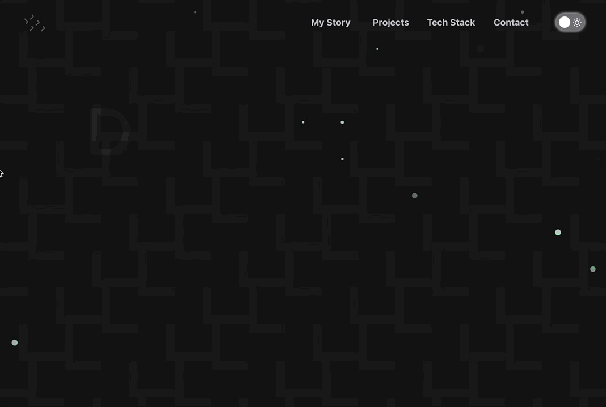

# [Portfolio](https://www.danielgrossberg.com)

See the live site :point_right: [here](https://www.danielgrossberg.com) :point_left:

This is my first attempt at creating a portfolio site. I built it to showcase my personal projects and tech interests, as well as to create new opportunities for myself as a developer. My goal with this project was to learn and implement at least one or two new (to me) technologies.

I'd been looking to learn TypeScript for some time, so I started by playing around with the language and getting a feel for its types and syntax. I also decided to move away from a simple create-react-app structure and utilize ViteJS as my build tool. This allowed me to take advantage of Vite's flexible configuration options and lightning-fast hot module replacement.

Later, I tapped into two third-party libraries - Chakra-UI and Framer Motion - to help create a customized set of components with simple, yet sleek animations. And finally, I started playing around with CSS-Doodle, a third-party web component for drawing patterns with CSS that is really a lot of fun to work with.

## Tech Stack

- TypeScript
- ViteJS
- React
- Chakra-UI
- Framer Motion
- CSS-Doodle

## Design Credits

- The site background design is adapted from a CSS-Doodle by [Alisa Kin](https://codepen.io/alisasila)
- The header font animation is based on a concept from [Håvard Brynjulfsen](https://codepen.io/havardob)
- Icons created by [Icons8](https://icons8.com)

## License

[MIT](https://choosealicense.com/licenses/mit/)
